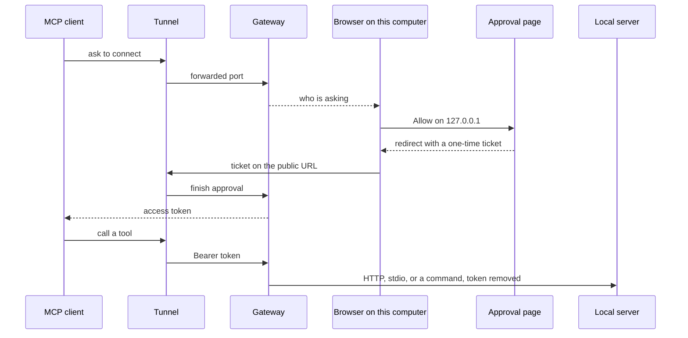

# porchlight

porchlight lets remote MCP clients, like Claude or ChatGPT, use what's running on your computer: an HTTP
MCP server, a stdio MCP server such as `npx some-mcp-server`, or a command-line program. Each one gets a public URL through
[OpenTunnel](https://github.com/anomalyco/opentunnel), and every client has to be approved on your computer
before it can connect.

> [!NOTE]
> porchlight is an experiment. Expect rough edges and breaking changes.

## Installation

porchlight requires [Bun](https://bun.sh):

```bash
bun install -g porchlight
```

Then start it next to a running MCP server:

```bash
porchlight
```

The first run asks how MCP clients should reach your computer. [OpenTunnel](https://github.com/anomalyco/opentunnel)
is one choice, and porchlight installs it for you. An HTTPS URL from a tunnel you already run is the other.
Change it later with `porchlight tunnel`.

Add the URL it prints as a remote MCP server in any MCP client that supports OAuth, then approve the connection
on your computer.

```
porchlight [app...]              Share apps (asks which the first time)
porchlight status                What's shared and who's connected
porchlight logs [--follow]       What clients did, live with --follow

porchlight apps                  List apps you can share
porchlight apps add              Add an app (asks for anything you leave out)
porchlight apps remove           Remove an app you added

porchlight clients               List the clients you approved
porchlight clients revoke        Take access away from a client

porchlight stop [app]            Stop sharing one app, or everything
porchlight tunnel [url]          Use OpenTunnel or your own tunnel
porchlight approve               Show a code to approve from another device
porchlight doctor                Check apps, tunnel and background service
```

`--read-only`, `--allow` and `--deny` limit which tools an app shares.

## Architecture

The client comes in through the tunnel. You approve it in a browser on this computer. Tool calls stop at the
gateway, which drops the token.



- One porchlight process serves every exposed server. Running `porchlight <app>` again adds the app through a
  local control socket instead of starting a second copy.
- The gateway listens on `127.0.0.1`. The tunnel forwards only that port. It serves OAuth and proxies
  `/<server>/mcp`.
- A stdio server is one process per client session. It gets the environment you set, and it stops when the
  session ends or goes idle.
- A command-line program is a list of tools in `porchlight.json`. porchlight runs one command per tool call,
  with no shell and no long-lived process.
- A server that is not running yet shows as waiting, then goes live when it starts.
- State lives in `~/.porchlight`, in `state.db`, `porchlight.json`, and logs. `PORCHLIGHT_HOME` moves that
  folder.

## Configuration

Settings live in `~/.porchlight/porchlight.json`. `porchlight apps add` writes it for you, or edit it by hand.
Top-level keys apply to every server, `servers` holds settings for one server, and flags win over both.

```json
{
  "$schema": "https://raw.githubusercontent.com/mahali00/porchlight/main/porchlight.schema.json",
  "readOnly": true,
  "tunnel": "https://mcp.example.com",
  "port": 43111,
  "servers": {
    "paper": { "readOnly": false, "deny": ["delete_nodes"] },
    "notes": {
      "url": "http://127.0.0.1:8080/mcp",
      "headers": { "Authorization": "Bearer ${NOTES_TOKEN}" }
    },
    "files": {
      "command": ["npx", "-y", "@modelcontextprotocol/server-filesystem", "/Users/me/Documents"],
      "env": { "LOG_LEVEL": "info" }
    },
    "garage": {
      "tools": {
        "status": { "run": ["garage", "status"], "readOnly": true },
        "open": { "run": ["garage", "open"], "description": "Open the garage door" },
        "light": { "run": ["garage", "light", "{state}"], "inputs": { "state": { "choices": ["on", "off"] } } }
      }
    }
  }
}
```

An app's name is also its URL path, so `porchlight notes` shares `notes` at `/notes/mcp`. `headers` and `env`
go to that app only, and `${NAME}` reads an environment variable. `url`, `command`, `env`, `cwd`, `headers`,
`tools` and `allowDangerous` only work per app. porchlight warns about unknown keys and ignores them.

`tools` shares a command-line program without writing an MCP server for it. Each entry is one tool that runs one
command, and the client fills in any argument written like `{state}`. There's no shell. Each input arrives as one
argument, and inputs starting with `-` are refused, so `a; rm -rf ~` is just text. porchlight also won't share a
command that hands client input to a shell or interpreter, like `sh -c {script}`, unless you set `allowDangerous`.
`porchlight apps add` asks for all of this, or pass `--tool status="garage status"`.

The OpenTunnel address stays the same while `~/.local/share/opentunnel` is kept. The certificate lasts 90 days,
and OpenTunnel does not renew it yet. If the address has to keep working, use your own tunnel.

```bash
porchlight tunnel https://mcp.example.com    # prints the local port to point it at
```

## Development

```bash
bun install
bun run check
```

`bun run check` runs the TypeScript checks, Prettier, and the tests.
