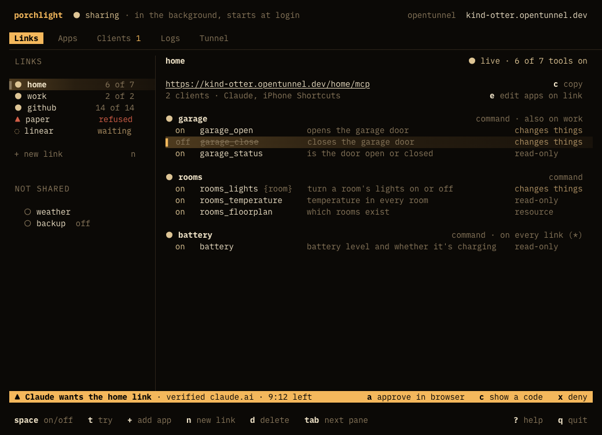

# porchlight

porchlight shares local MCP servers and command-line tools over HTTPS. Run it on the computer with the tools, then add the address it gives you to your MCP client. You approve the connection on the computer running porchlight.

It runs on macOS and Linux, with a terminal app and a CLI for adding tools, managing clients, and seeing what they call. [OpenTunnel](https://github.com/anomalyco/opentunnel) handles the tunnel by default, or you can use your own.



## Install

```sh
curl -fsSL https://github.com/mahali00/porchlight/releases/latest/download/install.sh | sh
```

## Use

```sh
porchlight
```

Press Enter to start sharing, then `+` in the Apps tab to add an MCP server or command-line tool. Copy an address from the Links tab into your MCP client, then approve the connection on this computer.

Press `?` for keyboard shortcuts. Sharing keeps running after you close the app. Run `porchlight stop` to stop it.

## CLI

Every action in the app is also a command. For example, share a local MCP server or a command-line tool:

```sh
porchlight apps add notes --url http://127.0.0.1:8080/mcp
porchlight apps add system --run "uname -a" --reads --link home
porchlight start
porchlight links
```

Each MCP server gets its own link. Command-line tools go on the links you choose with `--link`.

```sh
porchlight status
porchlight clients
porchlight clients approve
porchlight logs
```

Use `porchlight --help` or `porchlight <command> --help` for all options. Add `--json` for scripts.

## Configuration

Settings live in `~/.porchlight/porchlight.json`. You can edit it by hand, including comments. porchlight reloads it when you save. See [porchlight.schema.json](porchlight.schema.json) for every setting.

To use your own tunnel, forward it to the local port shown by `porchlight tunnel`, then set its public address:

```sh
porchlight tunnel use https://mcp.example.com
```

## Development

```sh
cargo fmt --check
cargo clippy --all-targets --locked -- -D warnings
cargo test --locked
```

CI runs these checks on macOS and Linux. Pushing a `v*` tag publishes the release binaries and `install.sh`.
